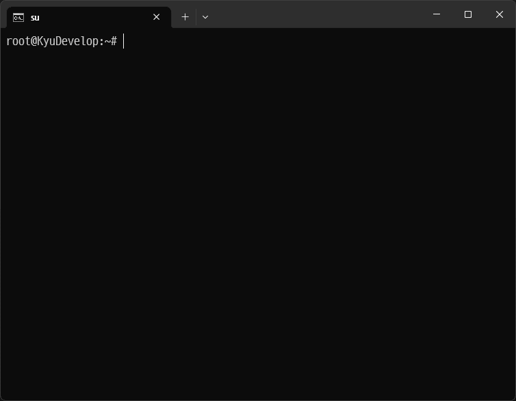

rw-tui :: Read & Write Everything
---------------------------------

This utility was created as a TUI application for Linux with reference to [RWEverything](http://rweverything.com/).

# How to use
1. Build the code in [@LeeKyuHyuk/fmem](https://github.com/LeeKyuHyuk/fmem) to `insmod`.
    - This is the latest fmem kernel module that implements Write function in the existing fmem.
2. Run `rw-tui` as root privileges

# Features supported
- Output the memory area as a table and change the value
- Output configuration space MMIO area of PCI device as table
- PCI configuration space output

# Hotkey
The shortcut keys below operate within the table:
- `PageUp` Key: Move forward 0x100 of the current address
- `PageDown` Key: Move back 0x100 of the current address
- `F2` Key : Move to Address Change Input
- `F5` Key : Refresh

# Thanks to
- [RWEverything](http://rweverything.com/) for the idea of this Application.
- [Nate Brune](https://github.com/NateBrune) and the contributors who developed fmem.

# License
MIT © [KyuHyuk Lee](https://kyuhyuk.kr) <[lee@kyuhyuk.kr](mailto:lee@kyuhyuk.kr)>